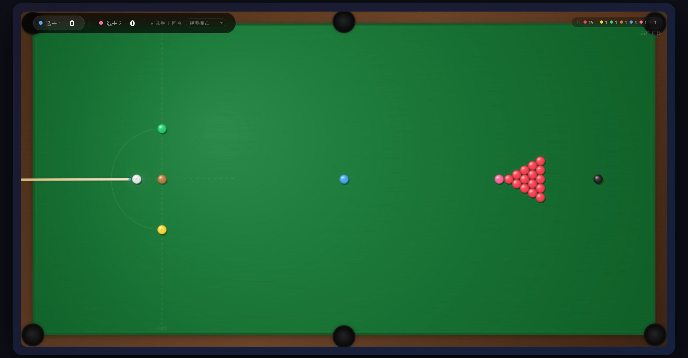

# Mini Snooker



A lightweight browser-based snooker game built with **HTML5 Canvas**, **CSS**, and **vanilla JavaScript**. The game is in Chinese, but I'm glad someone could translate it into English.

Mini Snooker is an arcade-style snooker mini game that runs directly in the browser. It includes a playable snooker table, cue aiming, power control, ball collision physics, scoring, fouls, multiple game modes, visual aiming assistance, and a polished in-game HUD.

This project is designed as a self-contained front-end game. It does not require a backend, database, build system, or external dependencies.

---

## Feature Summary

Mini Snooker currently includes the following main features:

- Browser-based gameplay
- HTML5 Canvas rendering
- Full snooker table layout
- Cue ball aiming
- Shot power control
- Ball collision physics
- Cushion bounce physics
- Pocket detection
- Two-player local scoring
- Turn switching
- Foul detection
- Foul penalty scoring
- Classic snooker-style gameplay
- Clearance mode
- Respotted black mode
- Ball count display
- Player HUD
- Power bar
- Foul toast messages
- End-game messages
- Mode selector (includes restart)
- Aiming prediction
- Target ball highlighting
- Post-collision direction arrows

---

## Current Implementation

The current implementation is a single-file front-end game.

The main file is:

```text
index.html
```

The file contains:

- HTML structure
- CSS styling
- Canvas setup
- Game constants
- Ball class
- Game state
- Ball initialization
- Physics loop
- Collision detection
- Pocket detection
- Rule handling
- Score handling
- Input handling
- Rendering logic
- HUD updates
- Mode switching

The project currently does not use:

- Backend services
- Databases
- Build tools
- External JavaScript libraries
- Frameworks
- Package managers

This makes the project easy to run, host, and modify.

---

## Game Modes

### Classic Mode

Classic Mode is the main game mode.

It includes:

- 15 red balls
- 6 colored balls
- Cue ball
- Red/color alternating phase
- Color clearance phase
- Fouls
- Scoring
- Turn switching
- End-game winner detection
- Respotted black when both players are tied

The gameplay follows a simplified snooker flow:

1. The player should pot a red ball.
2. After potting a red, the player should pot a colored ball.
3. Colored balls are respotted while red balls remain.
4. After all reds are cleared, the colors must be potted in order.
5. The player with the higher score wins.
6. If the score is tied after the final black, Respotted Black starts.

Ball values:

| Ball   | Value |
| ------ | ----: |
| Red    |     1 |
| Yellow |     2 |
| Green  |     3 |
| Brown  |     4 |
| Blue   |     5 |
| Pink   |     6 |
| Black  |     7 |

---

### Clearance Mode

Clearance Mode is a shorter mode focused on clearing the colored balls.

It includes:

- Cue ball
- Yellow ball
- Green ball
- Brown ball
- Blue ball
- Pink ball
- Black ball

The player must clear the colors in this order:

```text
Yellow → Green → Brown → Blue → Pink → Black
```

This mode is useful for quick play, practice, and testing the color-clearance rule logic.

---

### Respotted Black Mode

Respotted Black Mode is a sudden-death mode.

It includes:

- Cue ball
- Black ball

The black ball is placed on its spot, and the cue ball starts from the baulk area.

The win condition is simple:

- A legal black pot wins the game.
- Potting the cue ball can award the win to the opponent.
- Fouling can award the win to the opponent.
- Missing the black switches the turn.

Respotted Black can be selected manually from the mode selector or triggered automatically when Classic Mode ends in a tie.

---

## Rules Implemented

The current rule system includes:

- Red ball as the required target during red phase
- Colored ball as the required target after potting a red
- Ordered color clearance after all reds are gone
- First-contact checking
- Wrong first-contact foul
- Wrong ball potted foul
- Cue ball potted foul
- No-contact foul
- Foul penalty awarded to the opponent
- Colored ball respotting during red/color phase
- Colored ball respotting after fouls
- Turn continuation after a legal pot
- Turn switch after no pot
- Turn switch after foul
- Game-over detection
- Respotted black tie-break logic

This is a simplified arcade-style interpretation of snooker rules. It is not intended to fully reproduce every official tournament edge case.

---

## Scoring

The scoring system follows standard snooker ball values:

```text
Red     = 1
Yellow  = 2
Green   = 3
Brown   = 4
Blue    = 5
Pink    = 6
Black   = 7
```

Scores are tracked separately for Player 1 and Player 2.

The active player receives points for legal pots.

When a foul occurs, penalty points are awarded to the opponent.

The default foul penalty is 4 points, but it may be higher depending on the value of the involved ball.

---

## Visual Features

The game includes a custom-rendered snooker table and visual effects.

Current visual features include:

- Wooden outer frame
- Green felt table surface
- Felt texture effect
- Cushion border
- Six pockets
- Baulk line
- D-zone
- Ball spot markers
- Ball gradients
- Ball highlights
- Ball shadows
- Cue stick rendering
- Cue ball glow
- Target ball highlight
- Shot prediction line
- Collision contact marker
- Post-collision cue ball arrow
- Post-collision target ball arrow
- Player HUD
- Score display
- Active player indicator
- Ball count display
- Current target indicator
- Foul toast
- Center-screen message box
- Power bar

---

## Aiming and Shot Assistance

The game includes aiming assistance to make play easier and more readable.

Current aiming features include:

- Cue stick direction
- Aim line
- Collision prediction
- Contact point marker
- Cue ball post-collision direction arrow
- Target ball post-collision direction arrow
- Highlighting of legal target balls
- Next-color indicator during clearance

These assists make the game more approachable for casual players and help users understand the result of a shot before taking it.

---

## Physics System

The physics system is lightweight and designed for real-time browser gameplay.

Implemented physics features include:

- Ball position
- Ball velocity
- Friction
- Minimum speed cutoff
- Ball-to-ball collision detection
- Ball-to-ball collision response
- Cushion collision
- Cushion bounce
- Pocket detection
- Ball overlap separation
- Shot prediction simulation

The current physics model is intentionally simplified.

Known physics limitations:

- No cue ball spin
- No side spin
- No top spin
- No back spin
- No masse shots
- No jump shots
- Simplified cushion bounce
- Simplified collision response
- Simplified pocket jaw behavior

The physics are designed to feel responsive and fun rather than perfectly realistic.

---

## User Interface

The in-game UI includes:

- Player 1 score
- Player 2 score
- Active player indicator
- Current turn label
- Mode selector
- Remaining ball counter
- Current target display
- Power bar
- Power percentage display
- Foul notification
- Game message overlay
- Mode selector with restart

The UI is styled with a dark, modern visual theme and translucent HUD panels.

---

## Controls

### Mouse / Pointer Controls

| Action                    | Control                          |
| ------------------------- | -------------------------------- |
| Aim                       | Move pointer around the cue ball   |
| Start shot                | Click and drag away from cue ball  |
| Adjust power / angle      | Drag further / change direction    |
| Shoot                     | Release mouse button               |
| Enter drag mode (keyboard)| Press Space                        |
| Place cue ball            | Press P, then drag in D-zone       |
| Restart / Change mode     | Use mode selector in HUD           |

### Touch Controls

The canvas is configured with touch-friendly behavior such as disabled default touch actions.

Touch support is intended, but mobile precision may vary depending on screen size and browser.

---

## Technical Details

The game uses the Canvas 2D API for all table and ball rendering.

Major technical components include:

### Canvas Setup

The canvas is created in HTML and configured with fixed game dimensions based on the table layout.

### Game Constants

The game defines constants for:

- Ball radius
- Table size
- Cushion size
- Pocket radius
- Friction
- Bounce
- Maximum power
- Minimum speed
- Ball spacing
- Official-style ball positions

### Ball Class

Each ball stores:

- Position
- Radius
- Label
- Color
- Velocity
- Active state
- Potted state
- Speed
- Ball value
- Ball type

### Game State

The game tracks:

- All balls
- Cue ball
- Scores
- Current player
- Current phase
- Current game mode
- Current aiming angle
- Current shot power
- Foul state
- First contacted ball
- Balls potted during the current shot
- Whether the player needs to hit a red or a color
- Whether the game is in Respotted Black mode

### Physics Loop

The physics loop updates balls while a shot is in progress.

It handles:

- Ball movement
- Friction
- Cushion bounce
- Ball collisions
- Pocket checks
- Stop detection

### Rule Handling

Rule handling is triggered when balls are potted and when all balls stop moving.

It determines:

- Whether the shot was legal
- Whether a foul occurred
- Whether points should be awarded
- Whether balls should be respotted
- Whether the turn should continue
- Whether the turn should switch
- Whether the game has ended

### Rendering Loop

The rendering loop draws:

- Table
- Cushions
- Pockets
- Baulk line
- D-zone
- Balls
- Cue stick
- Aiming line
- Collision prediction
- UI-related visual helpers

---

## Project Structure

```text
mini-snooker/
├── index.html
├── README.md
```

---

## How to Run Locally

Open the following file in a modern browser:

```text
index.html
```

## Browser Support

Recommended browsers:

- Google Chrome
- Microsoft Edge
- Firefox
- Safari

A modern browser with Canvas 2D support is required.

The game is primarily designed for desktop browsers, but it includes responsive sizing and touch-related settings for smaller screens.

---

## Suggested GitHub Topics

```text
html5
canvas
javascript
game
snooker
billiards
pool
physics
browser-game
vanilla-js
canvas-game
```

---

## Known Limitations

Known current limitations include:

- Simplified physics
- No spin system
- No advanced cue control
- No AI opponent
- No online multiplayer
- Some official snooker edge cases may not be covered
- Mobile controls may need further improvement
- The code is currently mostly contained in a single HTML file

---

## Why This Project Is Useful

This project is a good front-end portfolio piece because it demonstrates:

- Canvas rendering
- Real-time animation
- Collision detection
- Interactive input handling
- Game state management
- Rule-based gameplay
- UI design
- Browser deployment
- Vanilla JavaScript development

It is more interactive and technically interesting than many basic front-end demo projects.

---

## Disclaimer

Mini Snooker is an arcade-style browser snooker game.

It is inspired by snooker rules and table layout, but it does not attempt to fully reproduce every detail of professional snooker physics or official tournament rule enforcement.

---

## Author

Created by Joeyfully.

---

## Contribution

Contributions, suggestions, and bug reports are welcome.

Possible contribution areas:

- Rule bug reports
- Physics improvements
- Mobile control improvements
- UI improvements
- Sound effects
- Code refactoring
- Documentation
- Test cases
